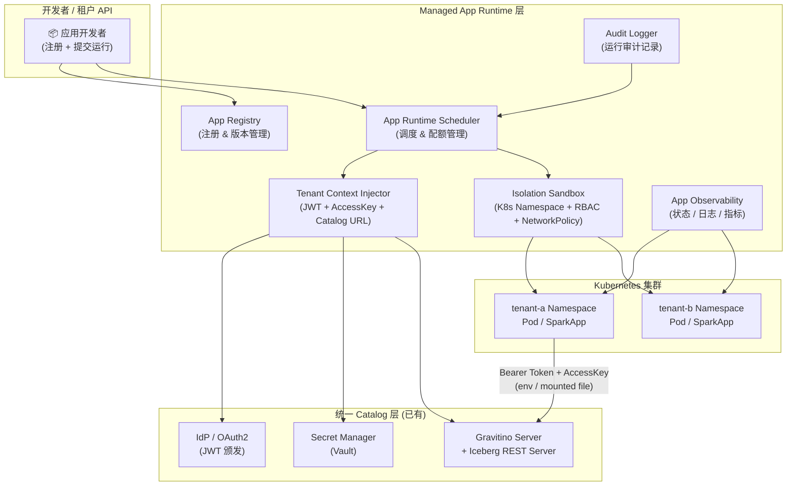

## Context

Lakehouse 平台（`unified-multi-tenant-catalog`）已提供基于 Apache Gravitino 的统一元数据层、MinIO 存储隔离、Iceberg REST Catalog 和多租户 ACL 体系。但数据应用的**运行入口**仍是空白：开发者需要自行搭建 Spark 连接、注入 JWT Token 和 MinIO AccessKey、申请 K8s 资源、配置网络策略。

托管应用运行时（Managed App Runtime）是 Lakehouse 平台的执行层，它接收应用声明，自动完成租户上下文注入，在隔离沙箱中运行应用，并将观测数据和审计日志统一归集。

**核心约束**：
- 应用必须运行在租户命名空间内，不能越界访问其他租户的 Catalog 资产或存储路径
- 上下文注入（Catalog URL、JWT、AccessKey）必须从 `unified-multi-tenant-catalog` 的 D5/D6 机制获取，不得绕过
- 平台对应用内部逻辑黑箱对待，只控制运行环境边界

### 整体架构



## Goals / Non-Goals

**Goals:**
- 提供声明式应用注册 API，支持 Docker 镜像、Spark 作业（jar/Python）等多种应用类型
- 实现应用运行调度：按租户配额分配 K8s 资源，支持队列和优先级
- 自动向运行中的应用注入租户 Catalog 上下文（Iceberg REST URL、JWT Token、MinIO AccessKey），应用通过环境变量消费
- 基于 K8s Namespace + RBAC + NetworkPolicy 实现租户级进程和网络隔离
- 提供运行实例状态查询和实时日志流 API
- 记录完整运行审计日志（租户 ID、应用 ID、资源用量、退出状态）

**Non-Goals:**
- 不包含计算资源（GPU、Spark Executor 内存）的动态弹性伸缩（本期仅固定配额）
- 不包含跨租户共享计算资源池（租户计算资源严格隔离）
- 不包含应用市场 / 商店功能（应用发现和共享）
- 不实现应用内部代码的安全扫描（信任应用镜像已通过 CI 安全检查）
- 不替换 Airflow 调度器（Airflow 作业通过独立路径提交，本 Runtime 面向"即席"和"平台原生"应用）

## Decisions

### D1: 应用运行载体 — Kubernetes 原生资源

**决策**: 应用运行实例映射为 Kubernetes 原生资源（普通应用 → Pod/Deployment，Spark 应用 → SparkApplication CRD via Spark Operator）

**理由**:
- 平台已运行在 K8s 上，无需引入额外的运行时基础设施
- Spark Operator 提供成熟的 SparkApplication 生命周期管理
- K8s Namespace + RBAC + NetworkPolicy 提供标准化的隔离机制

**替代方案考虑**:
- 独立 VM（每租户专属 VM）：启动慢、资源利用率低，成本高
- Ray Cluster / Flink Cluster：特化计算框架，不适合通用应用运行

### D2: 租户上下文注入方式 — 环境变量 + Projected Volume

**决策**: 平台在创建 Pod 前，通过 Kubernetes Init Container 或 Mutating Admission Webhook 将租户上下文注入为以下形式：

```
环境变量:
  PLATFORM_CATALOG_URL=http://gravitino:9001/iceberg/v1
  PLATFORM_CATALOG_TOKEN=<short-lived JWT>
  PLATFORM_MINIO_ENDPOINT=http://minio:9000
  PLATFORM_MINIO_ACCESS_KEY=<tenant-scoped-key>
  PLATFORM_MINIO_SECRET_KEY=<tenant-scoped-secret>
  PLATFORM_TENANT_NAMESPACE=<tenant-id>

挂载文件（可选，用于支持 spark-defaults.conf 模板）:
  /platform/catalog/spark-defaults.conf
```

**理由**:
- 环境变量是 12-Factor App 的标准配置方式，应用无需 SDK 改造即可接入
- Mutating Webhook 对应用透明，开发者无需感知注入机制
- JWT 短期有效（1h），AccessKey 通过 init container 从 Vault 动态获取，不持久化在 Pod Spec 中

**替代方案考虑**:
- SDK 方式（应用主动调用 Platform API 获取上下文）：需要改造所有应用，侵入性强
- ConfigMap 存储凭证：ConfigMap 内容在 etcd 中以明文存储，安全风险不可接受

### D3: 租户隔离实现 — K8s Namespace 级隔离

**决策**: 每租户映射一个独立的 K8s Namespace（`tenant-<tenantId>`），使用以下机制强化隔离：

| 隔离维度 | 机制 |
|----------|------|
| 进程隔离 | K8s Namespace 边界，Pod 无法访问其他 Namespace 资源 |
| 网络隔离 | NetworkPolicy：仅允许 Pod 访问 Gravitino / MinIO / ClickHouse，拒绝跨租户 Namespace 通信 |
| 权限隔离 | 每租户专属 ServiceAccount + RoleBinding，不绑定 ClusterRole |
| 凭证隔离 | Secret 仅挂载到本租户 Namespace，Vault 动态凭证有 TTL |
| 配额隔离 | ResourceQuota 限制每 Namespace 的 CPU / Memory / Pod 数量 |

**理由**: K8s 原生隔离机制经过大规模生产验证，与现有 Gravitino 多租户模型（Namespace = TenantId）保持自然对齐。

### D4: 应用调度策略 — 配额优先的 FIFO 队列

**决策**: 每租户维护独立的 FIFO 运行队列，调度器按租户 ResourceQuota 判断是否可立即调度，不可调度时入队等待

**理由**: 配额优先保证租户公平性，FIFO 保证同一租户内的提交顺序可预期。优先级队列作为后续演进。

### D5: 审计日志存储 — 写入平台 PostgreSQL + 租户 Iceberg 表

**决策**: 运行审计日志双写：平台 PostgreSQL（供平台管理员查询）+ 租户自己的 Iceberg 审计表（供租户自查）

**理由**: 审计数据是 Lakehouse 的一等公民，写入 Iceberg 表使租户可通过 Spark/SQL 对审计数据做二次分析，同时 PostgreSQL 保证平台侧的快速查询。

## Risks / Trade-offs

| 风险 | 严重度 | 缓解措施 |
|------|--------|----------|
| Mutating Webhook 注入失败导致应用启动无上下文 | 🔴 高 | Webhook 失败时 Pod 创建拒绝（fail-closed 策略），并向提交者返回明确错误；提供降级模式（开发环境跳过注入） |
| JWT Token 在长运行应用中过期 | 🟠 中 | Init Container 获取 Token 时其 TTL ≥ 应用预期最长运行时间；或 Sidecar 定期刷新 Token 并更新环境变量 |
| 租户 ResourceQuota 配置错误导致 Pod 无法启动 | 🟠 中 | 提交运行时预先校验 ResourceQuota 余量，不足时返回明确 `QUOTA_EXCEEDED` 错误而非静默入队 |
| NetworkPolicy 粒度不足导致跨租户横向移动 | 🔴 高 | 默认拒绝所有 ingress/egress，仅允许白名单 IP 段（Gravitino、MinIO、ClickHouse 的 ClusterIP）；定期 NetworkPolicy 合规审计 |
| 审计日志 Iceberg 写入失败不影响应用主流程 | 🟡 低 | 审计写入异步进行，失败重试 3 次后写入死信队列，不阻塞应用运行 |
| Spark Operator 版本与平台 Spark 版本兼容 | 🟠 中 | 锁定 Spark Operator 版本与 Spark 3.4 + Iceberg 1.4.x 同版本矩阵 |

## Migration Plan

1. **Phase 0 - Platform Prerequisites**: 确认 K8s 集群已部署 NetworkPolicy 插件（Calico/Cilium），部署 Spark Operator，为每个已有租户创建 K8s Namespace
2. **Phase 1 - App Registry**: 实现应用注册 API 和版本管理，验证应用元数据存储
3. **Phase 2 - Context Injection + Sandbox**: 实现 Mutating Admission Webhook，验证上下文注入端到端（环境变量、spark-defaults.conf 挂载）；部署 NetworkPolicy 并验证跨租户网络隔离
4. **Phase 3 - Scheduler + Quota**: 实现调度队列和 ResourceQuota 校验，验证多租户并发提交
5. **Phase 4 - Observability + Audit**: 接入日志流 API，实现 PostgreSQL + Iceberg 双写审计，验证审计数据可查

**回滚策略**: App Runtime 组件为独立控制面，不影响已有 Gravitino Catalog 和存储层；Webhook 支持 `failOpen/failClose` 切换，紧急情况可临时切回 failOpen 允许不带上下文的 Pod 启动。

## Open Questions

| # | 问题 | 决策前提 | 优先级 |
|---|------|----------|--------|
| OQ1 | **Webhook vs Init Container**: 上下文注入优选 Mutating Webhook（透明）还是显式 Init Container（可观测）？Webhook 需要 Kubernetes API Server 配置权限 | Phase 2 前 | 🔴 紧急 |
| OQ2 | **JWT 刷新策略**: 长时间 Spark 作业（> 1h）如何刷新 JWT？需确认平台 IdP 是否支持 offline_access / refresh_token | Phase 2 前 | 🟠 高 |
| OQ3 | **Spark 作业提交方式**: 租户通过 REST API 提交还是通过 Airflow DAG 触发 SparkApplication？两种方式的配额管理机制不同 | Phase 3 前 | 🟠 高 |
| OQ4 | **应用类型范围**: 本期是否仅支持 Docker 通用容器 + Spark，还是同时支持 Python 函数 / Jupyter Kernel？ | Phase 1 前 | 🟡 中 |
| OQ5 | **审计日志 Iceberg 表 schema**: 租户审计 Iceberg 表列定义需要评审，确认满足合规要求的字段集 | Phase 4 前 | 🟡 中 |
