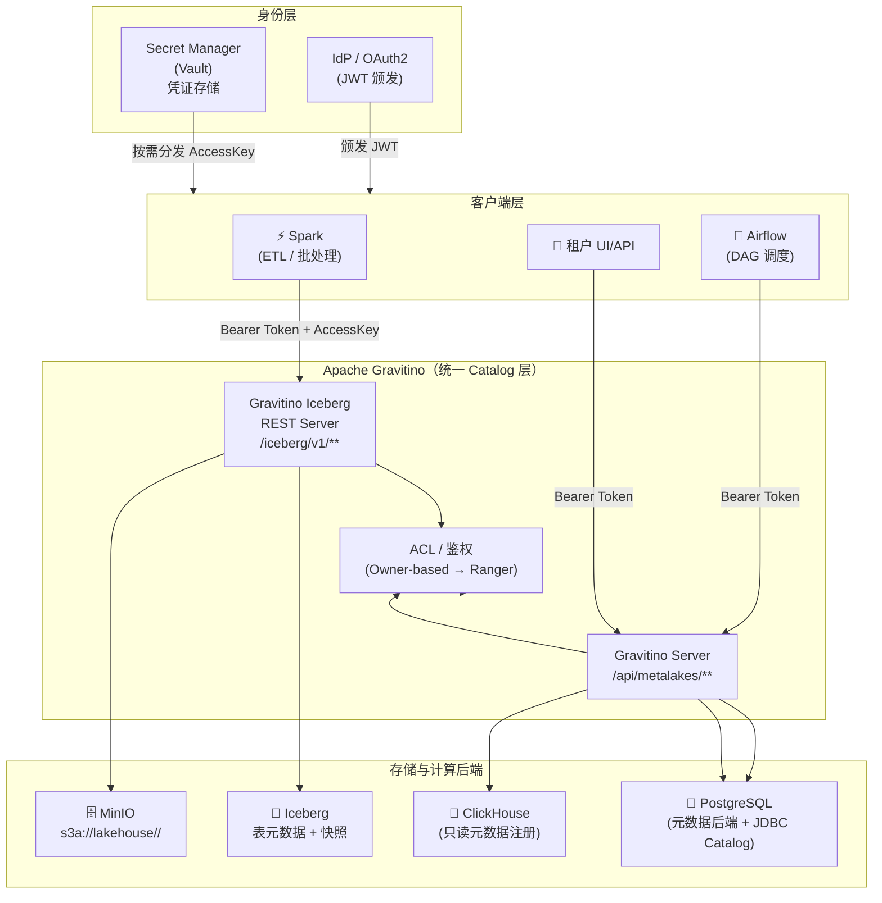

## Context

当前平台由独立部署的 MinIO（对象存储）、Apache Iceberg（表格式）、ClickHouse（OLAP 引擎）、PostgreSQL（关系数据库）、Spark（批处理引擎）和 Airflow（调度器）组成，各系统无统一元数据视图。数据工程师需要在不同系统间手动维护连接信息，租户无法独立发现和访问自己的数据资产，平台缺乏统一的权限管控层，且无法追踪跨系统数据血缘。

选择 **Apache Gravitino**（原 Datastrato Gravitino）作为统一 Catalog 层，因其原生支持多引擎（Spark、Trino、Flink）、内置 Iceberg REST Catalog 代理、JDBC Catalog 注册（ClickHouse/PostgreSQL），以及 Ranger 兼容的 ACL 体系，是当前开源生态中最成熟的统一元数据解决方案。

### 整体架构



## Goals / Non-Goals

**Goals:**
- 部署 Gravitino Server 作为统一元数据服务，支持全平台数据源注册
- 将 MinIO + Iceberg REST Catalog 接入 Gravitino，作为 Lakehouse 核心存储层
- 将 ClickHouse 和 PostgreSQL 以 JDBC Catalog 形式注册至 Gravitino
- 支持 Spark 通过 Gravitino Iceberg REST Catalog 执行 ETL 作业
- 支持 Airflow 通过 Gravitino REST API 查询元数据并追踪数据血缘
- 实现多租户隔离：租户级命名空间分配、存储路径前缀隔离、访问凭证独立管理
- 提供每租户专属的 Lakehouse 视图（独立 Iceberg namespace + MinIO prefix）

**Non-Goals:**
- 不包含 Gravitino UI 的定制化开发（使用原生 Web UI）
- 不包含 Trino/Flink 的集成（当前阶段仅 Spark）
- 不包含数据质量监控（DQ）和数据血缘的深度 UI 可视化
- 不替换 Airflow 的调度能力，仅在元数据层集成
- 不实现计算资源（Spark Cluster）的多租户隔离

## Decisions

### D1: 选择 Gravitino 作为统一 Catalog 层
**决策**: 使用 Apache Gravitino 替代自研 Catalog 注册表

**理由**: Gravitino 原生提供 Iceberg REST Catalog 代理（`gravitino-iceberg-rest-server`）、JDBC Catalog 实现（支持 ClickHouse/PG）、Ranger 集成，以及完整的 REST API，无需自研元数据管理逻辑。

**替代方案考虑**:
- 自研 Catalog Registry（REST API + DB）：维护成本高，缺乏 Spark/Trino 生态集成
- Project Nessie：专注于 Iceberg 事务型目录，不支持多类型数据源（ClickHouse/PG）
- Apache Atlas：元数据治理重，无原生 Iceberg REST Catalog 代理，集成复杂

### D2: 多租户隔离策略 — Namespace 级隔离
**决策**: 采用 Gravitino Metaspace → Catalog → Schema(Namespace) 三层结构实现租户隔离

**租户路径映射**:
```
Gravitino:   metalake=<platform> / catalog=lakehouse / namespace=<tenant-id>
MinIO:       s3a://lakehouse/<tenant-id>/
Iceberg:     catalog=lakehouse, namespace=<tenant-id>
```

**理由**: Namespace 级隔离粒度适中，既支持 Iceberg 原生命名空间语义，又与 MinIO 路径前缀和 Ranger 策略自然对齐。行级/列级隔离作为后续阶段演进。

**替代方案考虑**:
- Catalog 级隔离（每租户一个 Catalog）：Gravitino 管理开销大，租户间无法共享物理资源
- 表前缀隔离：无法通过 ACL 在 namespace 层面控制，安全边界模糊

### D3: Iceberg REST Server 部署模式
**决策**: 使用 Gravitino 内置的 `gravitino-iceberg-rest-server` 模式，而非独立部署 Iceberg REST Catalog

**理由**: 内置模式下 Iceberg REST 请求被 Gravitino 拦截并注入租户权限检查，而独立部署的 Iceberg REST Server 没有 Gravitino ACL 拦截能力，无法实现多租户隔离。

### D4: Airflow 集成方式
**决策**: Airflow 通过 Gravitino Python Client（或 REST API HTTP Hook）查询元数据，不直接访问 Iceberg/MinIO

**理由**: 统一元数据入口，避免 Airflow DAG 硬编码各系统连接信息，便于连接配置集中管理和审计。

---

### D5: 身份传播方案（Identity Propagation）

**决策**: 采用 OAuth2 JWT Bearer Token 作为跨系统租户身份传播的统一机制，MinIO 存储访问使用独立的租户专属 AccessKey，两者严格分离。

**身份传播链路**:

```
[IdP] ──颁发 JWT──▶ [客户端（Spark/Airflow/UI）]
                          │
                          ▼  Authorization: Bearer <JWT>
                    [Gravitino Server / Iceberg REST Server]
                          │  鉴权通过后
                          ▼
                    [后端系统（MinIO / CH / PG）]
                          ▲
[Secret Manager] ──按需分发──▶ [Spark Task AccessKey]
```

**各层身份配置**:

| 客户端 | 身份传播方式 | 配置项 |
|--------|-------------|--------|
| Spark | Header 注入 Bearer Token | `spark.sql.catalog.lakehouse.header.Authorization` |
| Airflow | HTTP Hook Header | `GravitinoMetadataHook`: `Authorization: Bearer <token>` |
| Spark 访问 MinIO | 租户专属 AccessKey（非 JWT） | `spark.hadoop.fs.s3a.access.key` / `secret.key` |
| 平台 UI | Bearer Token（标准 OAuth2 flow） | HTTP Header |

**理由**: JWT 在 Gravitino 层统一鉴权，MinIO 层使用 S3 原生 AccessKey 机制，两者职责分离，避免将 MinIO 凭证暴露在 HTTP 请求头中。

**替代方案考虑**:
- mTLS 客户端证书：运维复杂度高，租户证书轮换困难，暂不采用
- API Key（自研）：需要自建鉴权中间件，与 Gravitino 生态脱节

---

### D6: 凭证分发模型（Credential Distribution）

**决策**: 租户 MinIO AccessKey **不在 API 响应体中直接返回**，统一写入 Secret Manager（Vault 或云厂商 Secrets Manager），租户通过独立的凭证领取接口获取，领取链接具有一次性和时效性限制。

**凭证生命周期**:

```
POST /api/tenants
  └─▶ 创建 Gravitino namespace
  └─▶ 生成 MinIO Service Account
  └─▶ 写入 Secret Manager（path: secret/tenants/<tenantId>/minio）
  └─▶ 返回响应：{ tenantId, namespace, credentialRef }  ← 无明文凭证

GET /api/tenants/{tenantId}/credentials?token=<one-time-token>
  └─▶ 验证一次性 Token（有效期 15 分钟）
  └─▶ 从 Secret Manager 读取并返回凭证
  └─▶ 标记 Token 为已使用
```

**理由**: 防止 AccessKey 出现在 API Gateway 日志、Airflow DAG 日志、或被中间人截获。行业标准做法（HashiCorp Vault dynamic secrets 模式）。

**替代方案考虑**:
- 响应体直接返回凭证：实现简单但凭证泄漏风险极高，不可接受
- 仅邮件发送：无法程序化集成，不适合自动化 CI/CD 场景

---

### D7: PostgreSQL 实例分离

**决策**: Gravitino 元数据后端、Iceberg Catalog 后端和业务数据 PostgreSQL 使用**不同的 PostgreSQL 实例**，不共享同一实例。

**实例划分**:

| 实例 | 职责 | 负载特征 |
|------|------|----------|
| PG-Gravitino | Gravitino 元数据（metalake / catalog / schema 注册、ACL 策略） | 低写入、高读取 |
| PG-Iceberg | Iceberg 表 metadata pointer、commit OCC 事务锁 | 高并发写入，锁争用热点 |
| PG-Business | 业务数据（同时作为 Gravitino JDBC Catalog 注册源） | 独立业务负载 |

**理由**: Iceberg 多租户并发写入时，commit 事务锁争用集中在 PG-Iceberg 上（`SELECT FOR UPDATE` + OCC retry）。如果与 Gravitino 元数据共享实例，锁争用可能影响全平台的 Catalog 元数据查询延迟。物理分离消除此干扰。

---

### D8: 租户 Onboarding 原子性保障 — Process Manager 模式

**决策**: 租户创建（`POST /api/tenants`）涉及多个外部系统操作（Gravitino namespace → MinIO 路径/IAM → Secret Manager 凭证写入），采用 **Process Manager（编排型 Saga）** 模式保障最终一致性。

**Process Manager 状态机**:

```
TenantOnboardingProcess (持久化到 PostgreSQL)
  ├── step_1_gravitino_namespace: PENDING → DONE / FAILED
  ├── step_2_minio_path_and_policy: PENDING → DONE / FAILED
  ├── step_3_secret_manager_write:  PENDING → DONE / FAILED
  └── step_4_issue_ott:             PENDING → DONE / FAILED

每步执行后更新状态。任一步 FAILED 时，Process Manager 按逆序执行已完成步骤的补偿操作（回滚）。
```

**补偿操作**:

| 步骤 | 正向操作 | 补偿操作 |
|------|----------|----------|
| step_1 | 创建 Gravitino namespace `lakehouse.<tenantId>` | 删除该 namespace |
| step_2 | 创建 MinIO 路径前缀 + IAM Policy | 删除 IAM Policy + 删除前缀下的空目录 |
| step_3 | 写入凭证到 Secret Manager | 调用 `revoke(secretPath)` |
| step_4 | 签发一次性 Token | Token 不需补偿（有 TTL 自动过期） |

**理由**: 分布式环境下不可能依赖跨系统两阶段提交（Gravitino / MinIO / Secret Manager 各自独立事务）。Process Manager 将状态持久化，支持幂等重试和人工干预，保障最终每一步都执行或回退。

## Risks / Trade-offs

| 风险 | 严重度 | 缓解措施 |
|------|--------|----------|
| Gravitino 社区稳定性（Apache 孵化阶段） | 🟠 中 | 锁定具体稳定版本（0.7.x），避免跟随 SNAPSHOT；关键接口加抽象层以便替换 |
| ClickHouse JDBC Catalog 支持完整度未验证 | 🟠 中 | 实现前对 schema 列举、column type mapping 做 PoC 验证，确认支持范围 |
| Ranger 集成引入额外运维复杂度 | 🟡 低 | Phase 1 使用 Gravitino 内置 Owner-based ACL，Ranger 集成作为后续演进 |
| MinIO AccessKey 凭证泄漏 | 🔴 高 | 凭证不在响应体返回，统一写入 Secret Manager，通过一次性 Token 领取（见 D6）|
| Spark 连接 Gravitino Iceberg REST 的兼容性 | 🟠 中 | 锁定 Spark 3.4 + Iceberg 1.4.x + Gravitino Spark Connector 同版本矩阵，并在 CI 中验证 |
| Iceberg 多租户并发写入冲突 | 🟠 中 | Gravitino Iceberg REST Server OCC commit 接口提供原子性；Spark 配置 `commit.retry.num-retries=4`；需在目标并发量下压测 PostgreSQL 后端锁争用 |
| JWT Token 在 Spark 长作业中过期 | 🟠 中 | 配置 Spark Catalog 的 Token 自动刷新机制（`token-refresh-enabled=true`）；与 IdP 协商 Token 有效期 ≥ 预期最长作业时长 |

## Migration Plan

> [!IMPORTANT]
> 多租户安全基线（Namespace 隔离 + JWT 鉴权 + ACL 基础策略）必须与 Iceberg Catalog 同期完成（Phase 1），不得在无隔离状态下进入生产。

1. **Phase 0 - Infrastructure**
   - 部署 Gravitino Server（Docker Compose → K8s）
   - 部署 PostgreSQL 作为 Gravitino 元数据后端
   - 配置 MinIO 连接，创建 `lakehouse` bucket
   - 部署 IdP（Keycloak 或已有 OAuth2 服务），配置 Gravitino JWT 验证
   - 部署 Secret Manager（Vault），配置 MinIO AccessKey 存储路径

2. **Phase 1 - Core Catalogs + 多租户安全基线**（⚠️ 必须同期完成）
   - 创建 platform metalake
   - 注册 MinIO/Iceberg Catalog（`provider=lakehouse-iceberg`）
   - **实现 Tenant Namespace 分配 API**：创建 namespace + MinIO 路径前缀 + 写入 Vault
   - **配置 Gravitino Owner-based ACL**：租户只见自身 namespace
   - **配置 JWT 身份传播**（D5）：Spark、Airflow HTTP Hook 携带 Bearer Token
   - 验证跨租户 403 拦截（冒烟测试通过后方可进入下一阶段）

3. **Phase 2 - JDBC Catalogs**
   - PoC 验证 ClickHouse JDBC Catalog 的 schema 列举和 column type mapping
   - 注册 ClickHouse Catalog（只读）和 PostgreSQL Catalog（读写）
   - 验证元数据发现 API 返回正确结果

4. **Phase 3 - Spark 集成验证**
   - 配置 Spark 参考 `spark-defaults.conf`
   - 端到端验证：Spark 写 Iceberg 表 → MinIO 文件生成 → Spark 读取一致
   - 并发写压测：验证目标并发量下 PostgreSQL 后端锁争用在可接受范围

5. **Phase 4 - Airflow 集成**
   - 实现 `GravitinoMetadataHook` 和 `GravitinoIcebergSensor`
   - 更新 Airflow Connection 配置，Bearer Token 集成
   - 验证元数据驱动的 DAG 参数化执行

**回滚策略**: Gravitino 为旁路部署，不影响现有系统直连路径，若出现故障可直接回退到原有各系统独立连接模式。MinIO AccessKey / JWT 变更均有 Vault 版本记录，支持秒级回滚。

## Open Questions

| # | 问题 | 决策前提 | 优先级 |
|---|------|----------|--------|
| OQ1 | **Gravitino 版本选型**：0.7.x vs 0.8.x？需具体验证 ClickHouse JDBC Catalog 在各版本中的 schema 列举和 column type mapping 完整度 | Phase 2 开始前 | 🟠 高 |
| OQ2 | ~~**Secret Manager 选型**~~ **已决策**：采用 Simple Secret Manager（PostgreSQL-backed + AES-256-GCM），见变更 `simple-secret-manager` | ✅ 已关闭 | ✅ |
| OQ3 | **IdP 选型**：使用现有 OAuth2 服务还是新部署 Keycloak？影响 JWT 颁发和 Token 验证配置（D5） | Phase 0 开始前 | 🔴 紧急 |
| OQ4 | **Iceberg 并发写压测指标**：目标写并发数是多少（租户数 × 同时在线 Spark 作业数）？用于评估 PostgreSQL 后端是否需要读写分离 | Phase 3 前 | 🟠 高 |
| OQ5 | **JWT Token 有效期**：预期最长 Spark 作业时长是多少？用于确定 Token 有效期配置，避免长作业中途过期 | Phase 1 前 | 🟡 中 |
| OQ6 | **数据血缘回写**：Airflow 是否在 Phase 2 支持向 Gravitino 回写任务级血缘事件？需评估 Gravitino Lineage API 成熟度 | Phase 4 后 | 🟡 中 |
| OQ7 | **MinIO Versioning**：是否开启 MinIO Bucket Versioning 以支持 Iceberg position delete 文件机制？（可能影响存储成本） | Phase 1 前 | 🟡 中 |
| OQ8 | ~~**Gravitino HA**~~ **已决策**：Gravitino Server 必须多实例部署（K8s Deployment replicas ≥ 2 + Service 负载均衡），PostgreSQL 后端采用主从复制 | ✅ 已关闭 | ✅ |
